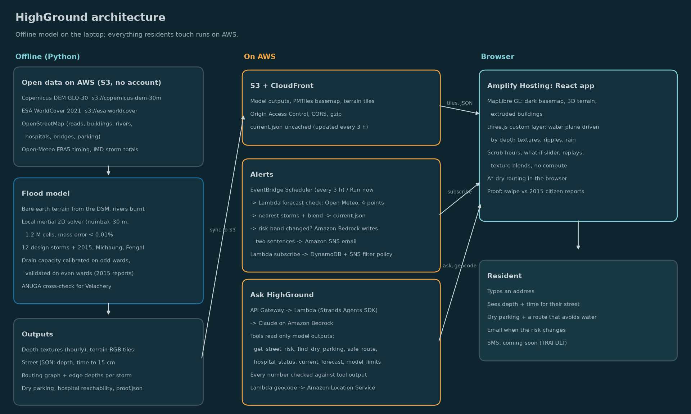

# HighGround

**Where the floodwater will go tonight in Chennai, street by street, and what to do about it.**

Type your address. The camera flies to your street, the water rises to tonight's forecast depth, and HighGround tells you how deep it gets, when it passes 15 cm, where to park your car on dry ground, a route there that avoids water, and which hospitals get cut off. Ask for an email and you will get one when your street's risk changes.

Chennai already has CFLOWS, a government flood warning system built for officials. HighGround is for the residents who still park their cars on the Velachery flyover every storm because nobody tells them where the water will go. We do not claim a better model than CFLOWS; we claim a tested one, built for citizens.

Built for **Environmental Hacks** (Bharat Builds Tour, WeMakeDevs × AWS), Heat and Water track.



## What is in the box

| Part | What it does |
|---|---|
| `pipeline/` | Offline Python. Fetches open data, builds a bare-earth terrain from the Copernicus surface model, runs a 2D flood model for 12 design storms and 3 historical storms, calibrates drain capacity on half the wards, validates on the other half, and exports tiles and JSON. |
| `infra/` | AWS SAM stack: S3 + CloudFront, Lambda (forecast check, subscribe, assistant, geocode), API Gateway, DynamoDB, SNS, EventBridge Scheduler, Amazon Bedrock via the Strands Agents SDK, Amazon Location Service, Amplify Hosting. |
| `web/` | Vite + React + TypeScript. MapLibre GL (dark Protomaps basemap, 3D terrain, extruded buildings) with a three.js custom layer for water and rain. Screens: Tonight, What if, Proof, Hospitals, About the model. |

## The model, briefly

- **Terrain:** Copernicus DEM GLO-30 (a surface model) → buildings, tree canopy (ESA WorldCover), bridges and unmapped tall objects masked and filled → 5th-percentile filter → rivers and drains burnt 2 m → buildings re-added as +3 m obstacles where they fill a cell and no road passes. 30 m grid, EPSG:32644, 836 × 1440 cells.
- **Solver:** local-inertial shallow water (Bates et al. 2010) in numba. Adaptive timestep, Froude cap, donor-cell limiter for exact mass conservation (mass error < 0.01% on every run). Rain is a source term; drains are one uniform capacity in mm/h on urban cells; infiltration on parks and open ground; the sea is held at mean or high tide; the land edges of the box are free outfalls.
- **Storms:** 50–400 mm in 24 hours (front-loaded) at mean and high tide; 1–2 Dec 2015 with and without the Chembarambakkam release (29,000 cusecs, CAG audit timeline); Cyclone Michaung 2023 (415 mm, IMD Meenambakkam); Cyclone Fengal 2024 (114 mm). Historical timing comes from ERA5 via Open-Meteo, scaled to IMD totals.
- **Calibration without cheating:** one number, storm-drain capacity, is tuned on odd-numbered GCC wards against the 2015 citizen flood reports and tested on even-numbered wards. Reports only mark flooded streets, so the score is the gain over an elevation-only map that floods the same amount of land. Every number is in `proof.json` and on the Proof screen.
- **Cross-check:** ANUGA (Geoscience Australia) on a box around Velachery and Pallikaranai.

The limits are written out on the About screen. The short version: 30 m satellite terrain, drains approximated, the reservoir release is an assumption, no storm surge, not an official warning.

## Run it

```bash
# offline model (Linux, no sudo): Miniforge env `highground`
source pipeline/env.sh
python pipeline/00_fetch.py          # DEM tiles, OSM, WorldCover, validation KMLs, ERA5 timing
python pipeline/01_condition.py      # terrain
python pipeline/inspect_kml.py       # look at the validation data before scoring it
pipeline/run_all.sh                  # calibration + all 16 runs (~5 h on a 2-core laptop)
python pipeline/06_validate.py       # proof.json
python pipeline/04_streets.py && python pipeline/05_features.py && python pipeline/07_export_tiles.py
python pipeline/gates.py p1|p2|p3    # scripted phase gates

# ANUGA cross-check (separate env)
~/miniforge3/envs/anuga/bin/python pipeline/03_anuga_velachery.py design_200_mean

# web, local
cd web && npm install && npx vite          # serves data from data/out/web via web/public/data

# AWS (profile from .env)
infra/deploy.sh
```

The Strands layer is built once with:

```bash
pip install --platform manylinux2014_x86_64 --python-version 3.12 --implementation cp \
  --only-binary=:all: --target infra/layers/strands/python strands-agents
```

## Address search

Amazon Location Service (Places API v2, biased to Velachery, filtered to India) answers first. If it returns nothing inside the model area, the Lambda falls back to OpenStreetMap Nominatim and the UI says which source answered. Without the API, the app still searches a local list of neighbourhood names from OpenStreetMap.

## Alerts

EventBridge Scheduler runs `forecast-check` every 3 hours. It reads Open-Meteo for Velachery, T. Nagar, Anna Nagar and Tambaram, maps the 24-hour mean to the two nearest modelled storms, writes `current.json`, and emails subscribers (SNS, filtered by street segment) whose risk band changed. Amazon Bedrock writes the two sentences from the model's numbers only. SMS to Indian numbers needs TRAI DLT registration, so it is marked "coming soon".

## Data and credits

Copernicus DEM GLO-30 (© DLR e.V. 2010–2014 and © Airbus Defence and Space GmbH 2014–2018, provided under COPERNICUS by the European Union and ESA); ESA WorldCover 2021 (CC BY 4.0); © OpenStreetMap contributors (ODbL); Protomaps basemap; Open-Meteo (CC BY 4.0) including ERA5 (Copernicus Climate Change Service); OpenCity and the osm-in flood-map contributors for 2015 citizen reports; Greater Chennai Corporation for hazard zones and ward boundaries (via OpenCity); NRSC 2015 inundation extent (via OpenCity); ANUGA (Geoscience Australia).

Not an official warning. Follow GCC, IMD and Tamil Nadu SDMA advisories. In danger, call 112.
